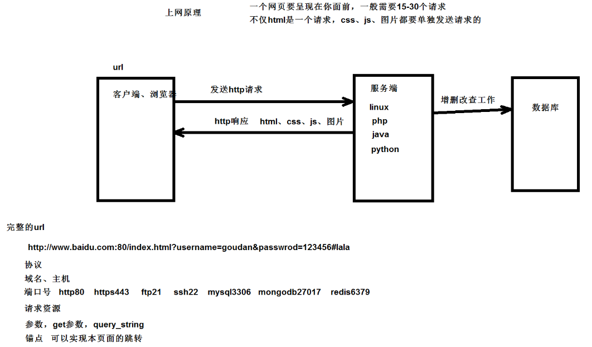
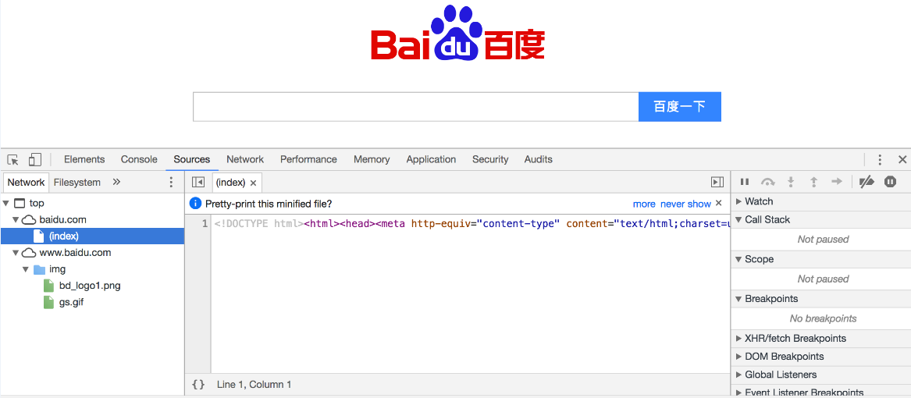
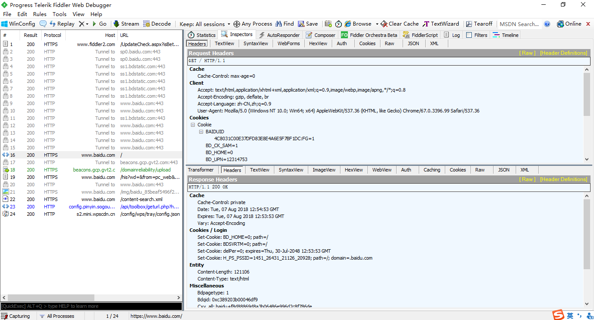

## 网络爬虫基本概念和相关工具

### 1.基本概念

**(1)什么是网络爬虫（web crawler）?** 

```python
以前经常称之为网络蜘蛛（spider），是按照一定的规则自动浏览万维网并获取信息的机器人程序（或脚本），曾经被广泛的应用于互联网搜索引擎。使用过互联网和浏览器的人都知道，网页中除了供用户阅读的文字信息之外，还包含一些超链接。网络爬虫系统正是通过网页中的超链接信息不断获得网络上的其它页面。正因如此，网络数据采集的过程就像一个爬虫或者蜘蛛在网络上漫游，所以才被形象的称为网络爬虫或者网络蜘蛛。
```

**(2)有哪些语言可以实现爬虫 ?**

```python
1.php: 号称世界上最好的语言
2.java: 可以实现,而且做的非常好,是python爬虫最主要的竞争对手,做的不好,语言不简洁,代码臃肿,重构成本高
3.c、c+ : 也可以实现爬虫，非常强大，编程语言排行榜，只能说你牛x，但是不是一个好的选择
4.python: 可以实现, 号称世界上最优雅的语言，代码简洁，学习成本低，执行效率也好，而且还有一个非常强大的爬虫框架scrapy
```

**(3)什么是通用爬虫 ?**

```python
例如：百度、谷歌、360、搜狗、必应等搜索引擎
1.做的工作：爬取互联网所有的数据, 对数据存储并且处理, 给用户提供检索服务
2.如何让百度抓取你的网站? 百度会和DNS服务商合作, 主动提交自己的url, 在其它网站设置友情链接
3.如何让网站不让百度抓取？君子协议(口头协议)，robots协议(存放在网站的根目录下)
4.网站排名（SEO）: (1)pagerank值排名(根据点击量、浏览量等，相当靠谱), （2）竞价排名
5.通用爬虫缺点：（1）抓取很多数据都是无效的（2）不能根据自己的需求抓取数据
```

**(4)什么是聚焦爬虫 ?**

```python
1.聚焦爬虫就是: 根据自己特定的需求，来抓取指定的数据
2.如何实现聚焦爬虫？
a.熟悉网页的特点：网页都有自己唯一的url, 都是由html组成, 网页传输都是使用http、https协议
b.爬取的思路：给一个url,模拟浏览器发送http请求,从html结构中提取指定的数据,从字符串中根据规则提取指定数据
c.开发环境：windows系统，python3.x（64位），sublime，pycharm，vscode编辑器等
```

**(5)爬虫的整体内容**

```python
1.涉及到的python库: urllib,requests,selenium,jsonpath,lxml等一些库
2.解析内容: 正则表达式解析，bs4解析，xpath解析，jsonpath解析
3.采集动态html: DOM操作，动态的添加或者删除节点，selenium+phantomjs
4.scrapy框架: 异步高性能网络爬虫框架
5.scrapy-redis分布式部署:在scrapy的基础上，多了一套分布式部署的组件
6.涉及到的爬虫-反爬虫-反反爬虫之间的斗争: 反爬会伤害真实的用户，一般情况下，反爬也就这么两点：第一个UA，	第二个封ip，第三个验证码，光学识别，打码平台
7.爬取失败就换思路解决问题：其他网站，手机端等
```

**(6)爬虫的应用领域**

```
在理想的状态下，所有ICP（Internet Content Provider）都应该为自己的网站提供API接口来共享它们允许其他程序获取的数据，在这种情况下爬虫就不是必需品，国内比较有名的电商平台（如淘宝、京东等）、社交平台（如腾讯微博等）等网站都提供了自己的Open API，但是这类Open API通常会对可以抓取的数据以及抓取数据的频率进行限制。对于大多数的公司而言，及时的获取行业相关数据是企业生存的重要环节之一，然而大部分企业在行业数据方面的匮乏是其与生俱来的短板，合理的利用爬虫来获取数据并从中提取出有商业价值的信息是至关重要的。当然爬虫还有很多重要的应用领域. 例如：搜索引擎, 新闻聚合, 社交应用, 舆情监控, 行业数据.
```

**(7)Robots.txt文件**

大多数网站都会定义robots.txt文件，下面以淘宝的[robots.txt](http://www.taobao.com/robots.txt)文件为例，看看该网站对爬虫有哪些限制。

```
User-agent:  Baiduspider
Allow:  /article
Allow:  /oshtml
Disallow:  /product/
Disallow:  /

User-Agent:  Googlebot
Allow:  /article
Allow:  /oshtml
Allow:  /product
Allow:  /spu
Allow:  /dianpu
Allow:  /oversea
Allow:  /list
Disallow:  /

User-agent:  Bingbot
Allow:  /article
Allow:  /oshtml
Allow:  /product
Allow:  /spu
Allow:  /dianpu
Allow:  /oversea
Allow:  /list
Disallow:  /

User-Agent:  360Spider
Allow:  /article
Allow:  /oshtml
Disallow:  /

User-Agent:  Yisouspider
Allow:  /article
Allow:  /oshtml
Disallow:  /

User-Agent:  Sogouspider
Allow:  /article
Allow:  /oshtml
Allow:  /product
Disallow:  /

User-Agent:  Yahoo!  Slurp
Allow:  /product
Allow:  /spu
Allow:  /dianpu
Allow:  /oversea
Allow:  /list
Disallow:  /

User-Agent:  *
Disallow:  /
```

注意上面robots.txt第一段的最后一行，通过设置“Disallow: /”禁止百度爬虫访问除了“Allow”规定页面外的其他所有页面。因此当你在百度搜索“淘宝”的时候，搜索结果下方会出现：“由于该网站的robots.txt文件存在限制指令（限制搜索引擎抓取），系统无法提供该页面的内容描述”。百度作为一个搜索引擎，至少在表面上遵守了淘宝网的robots.txt协议，所以用户不能从百度上搜索到淘宝内部的产品信息。

### 2. HTTP协议

协议是什么？协议就是规定好的传输方式

上网原理

参考博客https://www.cnblogs.com/wqhwe/p/5407468.html

图解http协议
https://www.cnblogs.com/10158wsj/p/6762848.html

HTTPS和HTTP的区别主要如下：

```
1、https协议需要到ca申请证书，一般免费证书较少，因而需要一定费用。
2、http是超文本传输协议，信息是明文传输，https则是具有安全性的ssl加密传输协议。
3、http和https使用的是完全不同的连接方式，用的端口也不一样，前者是80，后者是443。
4、http的连接很简单，是无状态的；HTTPS协议是由SSL+HTTP协议构建的可进行加密传输、身份认证的网络协议，比
```

HTTP请求：包含请求行、请求头、请求内容


```
请求行：请求方式、请求资源、协议版本号
			请求头：
				accept:浏览器通过这个头告诉服务器，它所支持的数据类型
			　　Accept-Charset: 浏览器通过这个头告诉服务器，它支持哪种字符集
			　　Accept-Encoding：浏览器通过这个头告诉服务器，支持的压缩格式
			　　Accept-Language：浏览器通过这个头告诉服务器，它的语言环境
			　　Host：浏览器通过这个头告诉服务器，想访问哪台主机
			　　If-Modified-Since: 浏览器通过这个头告诉服务器，缓存数据的时间
			　　Referer：浏览器通过这个头告诉服务器，客户机是哪个页面来的  防盗链
			　　Connection：浏览器通过这个头告诉服务器，请求完后是断开链接还是何持链接
				X-Requested-With: XMLHttpRequest  代表是ajax的请求
```

响应：响应行、响应头、响应内容


```
响应行里面，常见的状态码
			响应头：对我们来说不重要
				Location: 服务器通过这个头，来告诉浏览器跳到哪里
			　　Server：服务器通过这个头，告诉浏览器服务器的型号
			　　Content-Encoding：服务器通过这个头，告诉浏览器，数据的压缩格式
			　　Content-Length: 服务器通过这个头，告诉浏览器回送数据的长度
			　　Content-Language: 服务器通过这个头，告诉浏览器语言环境
			　　Content-Type：服务器通过这个头，告诉浏览器回送数据的类型
			　　Refresh：服务器通过这个头，告诉浏览器定时刷新
			　　Content-Disposition: 服务器通过这个头，告诉浏览器以下载方式打数据
			　　Transfer-Encoding：服务器通过这个头，告诉浏览器数据是以分块方式回送的
			　　Expires: -1  控制浏览器不要缓存
			　　Cache-Control: no-cache  
			　　Pragma: no-cache
			响应内容：html、css、js、图片
```

### 3.抓包相关工具

**(1)Chrome Developer Tools：谷歌浏览器内置的开发者工具。**

```
	（1）谷歌浏览器自带抓包工具
		右键开发者工具==》network
		XHR: XMLHttpReqeust  前端要想发送ajax请求，通过它创建对象，发送请求
		query_string_parameters : 请求字符串，get参数
		formdata ： 如果是post参数
```




**(2)POSTMAN：功能强大的网页调试与RESTful请求工具。**


**(3) fiddler: 非常专业的工具**



```
专业抓包工具，比谷歌强在了跳转的时候很多请求都能抓取到

	点击actions==》trust root certificate
	配置完毕，重启fiddler让其生效

	如果有问题，参考这个博客
	https://blog.csdn.net/d1240673769/article/details/74298429
2、清楚所有请求
	叉号==》remove all
3、暂停和启动抓包
	file==>capture traffic
4、fiddler介绍
	左边栏
		显示所有的请求
		<> : 代表的是html请求
	右边栏
		点击某个请求，查看这个请求的详细信息
		选中inspectors
		右上：请求信息
			raw：有关所有请求的纯文本内容
			webforms：请求参数
				上面：query_string   get参数
				下面：body   post参数
		右下：响应信息
			raw：所有响应的纯文本内容
			json：如果响应为json格式数据，在这里查看
	左下角黑色窗口输入指令
		cls：清除掉所有请求
		select html: 选择html请求
		select js: 选择js请求
		?baidu: 选择带baidu的请求
```

### 4.urllib库

```
urllib库是什么？自带的python库，模拟发送http请求
	python 2系列：urllib  urllib2
	python 3系列：urllib  
		urllib.request  模拟发送请求
			urlopen(url) : 向url发送请求，得到响应对象
			urlretrieve(url, filepath) ： 向url发送请求，直接将响应写入到filepath中
		response属性和方法
			字符串格式==》字节格式
				encode('utf8')
			字节格式==》字符串格式
				decode('gbk')
			response.read()  : 读取字节格式内容
			response.url : 获取请求url
			response.headers: 响应头部
			response.status: 状态码
		下载图片：得到图片的src属性，就可以将图片下载到本地
		urllib.parse    处理参数或者url
		urllib.error    如何处理异常
```

### 5.爬取数据的实现原理及步骤: 

一个基本的爬虫通常分为数据采集（网页下载）、数据处理（网页解析）和数据存储（将有用的信息持久化）三个部分的内容，当然更为高级的爬虫在数据采集和处理时会使用并发编程或分布式技术，这就需要有调度器（安排线程或进程执行对应的任务）、后台管理程序（监控爬虫的工作状态以及检查数据抓取的结果）等的参与。


一般来说，爬虫的工作流程包括以下几个步骤：

1. 设定抓取目标（种子页面/起始页面）并获取网页。
2. 当服务器无法访问时，按照指定的重试次数尝试重新下载页面。
3. 在需要的时候设置用户代理或隐藏真实IP，否则可能无法访问页面。
4. 对获取的页面进行必要的解码操作然后抓取出需要的信息。
5. 在获取的页面中通过某种方式（如正则表达式）抽取出页面中的链接信息。
6. 对链接进行进一步的处理（获取页面并重复上面的动作）。
7. 将有用的信息进行持久化以备后续的处理。
