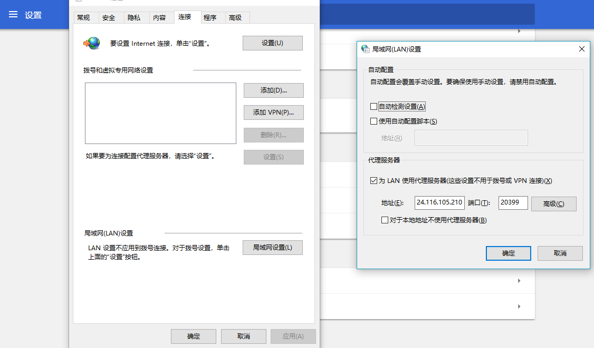

## 1. 代理

#### 代理服务器有：快代理、西祠代理、芝麻代理、阿布云代理等

**（1）浏览器如何设置代理:**

​	以谷歌浏览器为例:  打开设置-->高级-->打开代理设置-->局域网设置-->选择代理服务器



**（2）代码中如何设置代理:**

```python
import urllib.request

url = 'http://www.baidu.com/s?ie=UTF-8&wd=ip'
handler = urllib.request.ProxyHandler(proxies={'http': '218.60.8.98:3129'})
opener = urllib.request.build_opener(handler)

r = opener.open(url)

with open('代理.html', 'wb') as fp:
    fp.write(r.read())
```

**(3) 代理ip池、阿布云使用**

```python
import urllib.request
import base64

user = 'HCQ4X00T441PYI5D'
pwd = 'E8C159C7668242ED'

# 将用户名和密码拼接后再转化
string = user + ':' + pwd
# 进行base64编码
ret = 'Basic ' + base64.b64encode(string.encode('utf8')).decode('utf8')
# print(ret)

url = 'http://www.baidu.com/s?ie=UTF-8&wd=ip'
headers = {
	'Proxy-Authorization': ret
}
# 构建请求对象
request = urllib.request.Request(url=url, headers=headers)

handler = urllib.request.ProxyHandler(proxies={'http': 'http-dyn.abuyun.com:9020'})
opener = urllib.request.build_opener(handler)

r = opener.open(request)

with open('ip.html', 'wb') as fp:
	fp.write(r.read())
```

## 2. cookie的使用

**(1) 为什么使用cookie?** 客户端 --> 服务器   每一次请求都是单独的请求，请求之间没有任何关系, 登录时候是一个			请求; 访问登录后的页面又是一个请求，这两个请求必须有关系，所以引入了cookie

**(2)浏览器在登录的时候**，服务端给你响应，在响应里面就有cookie，浏览器就会将cookie保存起来，下次再请求的时候，就会带着cookie来访问

**(3)通过代码访问登录后的页面(通过抓包)**:首先让浏览器登录成功，然后浏览器再访问登陆后页面的时候，来抓包，抓取到请求头里面的cookie信息，然后写到代码中即可

**(4)模拟登陆**: 首先抓包抓取post请求，通过代码模拟发送post请求，然后创建ck对象，用来保存和携带cookie即可

(5)详情见代码:15-16

## 3. 正则表达式

#### (1) 单字符规则：

​		\d : 所有的数字字符
		\D : 非\d
		\w : 数字、字母、下划线、中文
		\W : 非\w
		\s : 匹配所有的空白字符  \n \t 空格
		\S : 非\s
		[] : [aeiou]
		.  : 除了\n以外任意字符
		[^aeiou] : 除了里面写的都能匹配

#### (2) 数量修饰：

​		{m} ：修饰前面的字符出现m次
		{m,} : 修饰前面的字符最少m次  贪婪的  能多匹配就多匹配
		{m,n} : 最少m次，最多n次
		{0,} : 任意多次   *
		{1,} : 最少1次    +
		{0,1} : 可有可无  ?

#### (3) 在python中使用:

```python
import re
pattern = re.compile(r'xxx')
pattern.match()   从字符串开头查找，找到一个结束
pattern.search()  从字符串任意位置开始查找，找到一个立马结束
ret.group()   得到匹配内容
ret.span()    得到匹配位置
pattern.findall() 返回列表，得到所有匹配的内容
```

#### (4) 边界修饰：

​		^ : 以某某开头
		$ : 以某某结尾

#### (5) 分组：（正则的高级功能）( )

​		A、视为一个整体    (a\d){5}
		B、子模式、分组
			(?P<goudan>)  (?P=goudan)
			\1  \2   第一、二个小括号匹配的内容
			$1  $2   第一、二个小括号匹配的内容
			如果有子模式  ret.group(1)就是第一个子模式匹配的内容

```python
string = '哈哈<div><span>天青色等烟雨,而我在等你</span></div>嘻嘻'
pattern = re.compile(r'<(\w+)><(\w+)>.*</\2></\1>')
# pattern = re.compile(r'<(?P<goudan>\w+)><(?P<maodan>\w+)>.*</(?P=maodan)></(?P=goudan)>')

ret = pattern.search(string)
print(ret.group())
print(ret.group(1))
print(ret.group(2))
```

#### (6) 贪婪：

​		.* 任意多个 
		.+ 一个到多个 
		.*?  取消贪婪
		.+? 

```python
string = '<div>啦啦啦啦啦啦，我是卖报的小行家</div></div></div></div>'
pattern = re.compile(r'<div>(.*?)</div>')
ret = pattern.search(string)

print(ret.group(1))
```

#### (7) 模式修正：

​		re.I : 忽略大小写
		re.M : 视为多行模式
		re.S : 视为单行模式

```python
# re.I : 忽略大小写
    
string = 'love is a forever topic'
pattern = re.compile(r'LOVE', re.I)

ret = pattern.search(string)

print(ret.group())
```

```python
# re.M : 多行模式
    
string = '''细思极恐
你的对手在看书
你的敌人在磨刀
你的闺蜜在减肥
隔壁老王在炼腰
'''
pattern = re.compile(r'^你的', re.M)
ret = pattern.search(string)

print(ret.group())
```

```python
# re.S : 单行模式
string = '''<div>沁园春-雪
北国风光，千里冰封，万里雪飘
望长城内外，惟余莽莽
大河上下，顿失滔滔
</div>'''
pattern = re.compile(r'<div>(.*?)</div>', re.S)
ret = pattern.search(string)
print(ret.group(1))
```

## 4、正则案例

#### (1)糗事百科糗图片下载: 见代码18

​		https://www.qiushibaike.com/pic/page/1/
注意: 有的网站图片不让下载：
		防盗链，直接通过urllib.request.urlretrieve()下载不了
		在请求头部有一个referer，判断头部是不是从这个网站过来的，如果是，可以看图片，如果不是，图片不让看.
		通过程序看这个图片的时候，需要手动定制Referer：定制为网站的首页即可。需要通过构建请求对象，发送请求，将响应写到文件中这种方式进行下载

#### (2)段子文本下载:  见代码19