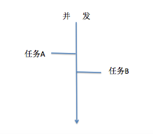

## 1.同步、异步，并行、并发之间的区别:

**(1)同步：**先执行任务a，在执行任务b，称任务a和b是同步的:


**(2)异步：**任务a和任务b同时执行，称任务a和b是异步的

**注意:** 实现异步的时候，还有不同，一种是真正的异步，一种是伪异步


**(3)并行：**真正的异步


**(4)并发：**伪异步，通过计算机的快速切换，达到同时运行的假象



## 2.进程

**(1)电脑中的进程：**启动一个软件之后就是一个进程.

**(2)代码中的进程：**没有运行之前，称之为程序，程序运行起来就是一个进程，如果只有一个进程，称之为主进	    程。如果通过这个进程创建了其他进程，称之为子进程.
**(3)进程创建（process）**

**（A）面向过程**

```python
p = Process(target=xxx, args=(xxx,))
target : 进程启动之后要执行的函数
args   : 主进程给子进程传递的参数
p.start() : 启动进程
p.join()  : 主进程等待子进程结束
os.getpid()  : 获取进程id
os.getppid() : 获取父进程id
```

 **（B）面向对象**

```python
class MyProcess(Process):
    def run(self):
    	pass
如果传递参数，需要重写构造方法，注意手动调用父类构造方法
```

 **（C）进程之间是否共享局部变量**

```python
不共享局部变量
```

 **（D）进程之间是否共享全局变量**

```python
不共享全局变量
```

 **（E）进程池**

```python
一个进程，没有充分利用电脑的性能是不行的, 一般5个进程就能将100个文件全部拷贝成功。
意思就是：最多就创建5个进程，然后你给他100个任务，5个进程将100个任务全部执行完毕。

po = Pool(5)   # 创建进程池
po.apply_async(demo, args=(xxx,))  # 给进程池添加任务并且传递参数
po.close()  # 关闭进程池，不再向里面添加任务
po.join()  # 让主进程等待进程池中所有进程结束之后再结束
```

## 3.线程

**(1)线程的理解：**比如打开一个QQ软件可以语音，可以视频;  打开一个暴风影音, 可以播放音频，播放视频等.

​			一个进程里面如果只有一个线程，称之为主线程，如果还有其它线程，称之为子线程.
**(2)cpu切换的基本单位是线程**
    多进程：切换进程消耗资源大，但是稳定，如果一个子进程挂了，不影响其它进程
    多线程：切换线程消耗资源小，但是不稳定，如果一个线程挂了，整个进程就挂了
**(3)线程创建（thread）**
    **（A）面向过程**

```python
t = threading.Thread(target=xxx, name=xxx, args=(xxx, ))
target: 线程启动执行的函数
name: 线程的名字
args: 给子线程传递参数
threading.current_thread().name : 获取线程名字
t.start() : 启动线程
t.join()  : 让主线程等待
```

​    **（B）面向对象**

```python
class MyThread(threading.Thread):
	def run(self):
		pass
如果传递参数，需要重写构造方法，注意手动调用父类构造方法
```

   **（B）线程之间能否共享局部变量**

```python
不共享局部变量
```

   **（C）线程之间是否共享全局变量**

```python
共享全局变量
```

   **（D）线程安全**

```python
使用线程锁来解决，谁先抢到谁先用
from threading import Lock
lock = Lock()
lock.acquire()  加锁
lock.release()  解锁
```

   **（E）队列：**

```python
队列：买火车票，先进先出
栈：先进后出  函数的运行

from queue import Queue
q = Queue(5)
```

   **（F）添加元素**

```python
q.put(xxx)
q.put(xxx, False)  如果队列满，立即抛出异常
q.put(xxx, True, 5) 如果队列满，5s之后抛出异常
```

   **（G）获取元素**

```python
q.get()
q.get(False)   如果队列为空，立即抛出异常
q.get(True, 5) 如果队列为空，5s之后抛出异常

q.full()  队列是否满
q.empty() 队列是否空
q.qsize() 队列的元素的个数

线程加队列---生产者消费者模型
    while True:
        生产数据
        消费数据

    生产数据线程
        队列
    消费数据线程
```
## 4.多线程爬取(见代码53)

   

```python
 while True:
        根据url发送请求，得到响应（生产者）
        解析响应（消费者）
    生产者线程  3
        队列
    消费者线程  3
```

**图解进程和线程(详情见代码42-53)**

